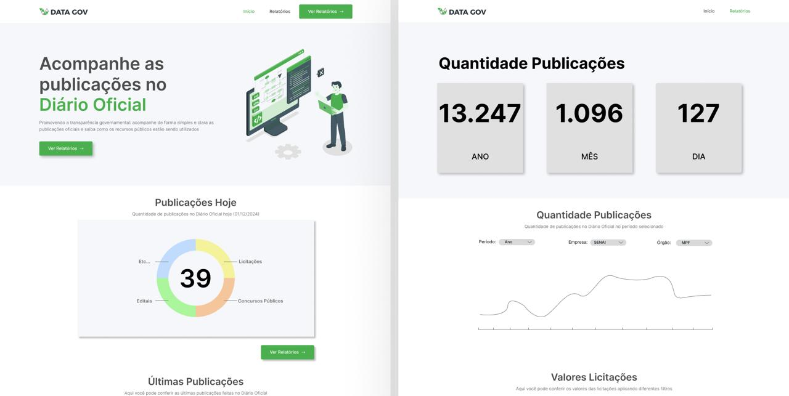

# Concursei BR

Este projeto envolve a matéria de Métodos de Desenvolvimento de Software e a sua ultilização prática no desenvolvimento de sistemas. O objetivo do Concursei BR é servir à população como um "mapa" das vagas de concursos no Brasil inteiro, conferindo dados importantes para que os interressados possam analisar e se organizar melhor. Permitindo também a exportação dos dados personalizados.



> Status: Em desenvolvimento ⚙️🔨

---

## Público Alvo
Cidadãos de todo o Brasil, incluindo:

- Concurseiros
- Trabalhadores
- Estudantes

---

## Linguagem e bibliotecas utilizadas 🦾
- [Python 3.12](https://www.python.org/downloads/)

  **- - Bibliotecas - -**<br>
  
.Pandas<br>
.Plotly<br>
.Streamlit<br>
.Numpy<br>
.Matplotlib<br>
.BeautifulSoup<br>
.folium<br>
. ...

## Execução 🖥️
Clone o repositório deste projeto através da seguinte linha de código:
```bash
git clone https://github.com/unb-mds/2024-2-Concursei_Br.git
```

Com <b>Python</b> instalado, faça a instalação das bibliotecas com o seguinte comando no terminal:
```bash
pip install -r requirements.txt
```

Com o repositório clonado execute o programa com:
```bash
cd .\concursei_br\app\
streamlit run home.py
```
## Extras
 
 • [Arquitetura](https://unb-mds.github.io/2024-2-Concursei_Br/arquitetura/)

 • [Gitpages](https://unb-mds.github.io/2024-2-Concursei_Br/)
 

## Equipe 👤


|  |  |  |
|-----------------------------------------------------|------------------------------------------|------------------------------------------|
| **[Luiz Bessa](https://github.com/lfelipebessa)** | **[José Victor](https://github.com/RR2M4A)** | **[Marco Marques](https://github.com/marcomarquesdc)** |

|  |  |  |
|------------------------------------------|------------------------------------------|------------------------------------------|
| **[Eduardo Waski](https://github.com/EduardoWaski)** | **[Artur de Camargos](https://github.com/ArturDCR)** | **[André Meyer](https://github.com/AndreMeyerr)** |


