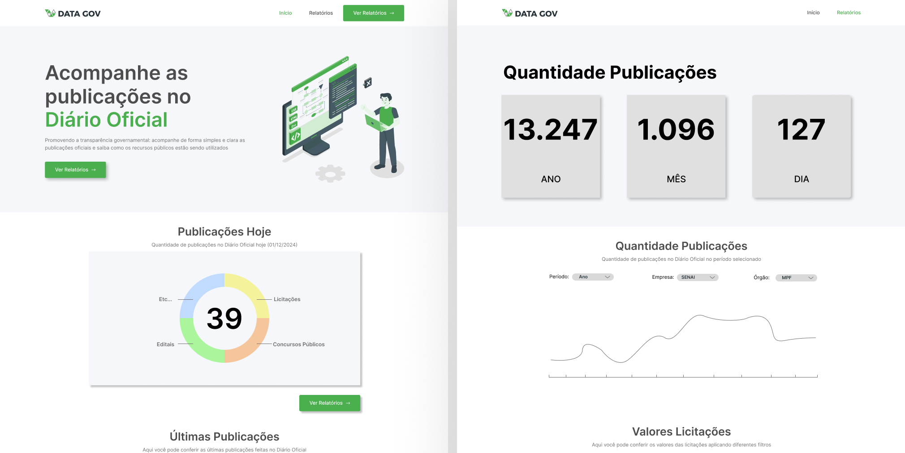

# Painel de Transparência Municipal

Este projeto envolve a matéria de Métodos de Desenvolvimento de Software e a sua ultilização prática no desenvolvimento de sistemas. Objetivo de criar um painel de transparência municipal acessível e intuitivo que permita aos cidadãos monitorar e entender facilmente como os recursos públicos estão sendo utilizados, promovendo a participação cidadã e a confiança na administração pública. 



> Status: Em desenvolvimento ⚙️🔨

---

## Público Alvo
Todos os cidadãos do município, incluindo:

- Residentes
- Jornalistas
- Pesquisadores
- Autoridades públicas

---

## Linguagem e bibliotecas utilizadas 🦾
- [Python 3.12](https://www.python.org/downloads/)

  **- - Bibliotecas - -**<br>
  
.Pandas<br>
.Plotly<br>
.Streamlit<br>
.Numpy<br>
.Matplotlib<br>
.BeautifulSoup<br>
.Unidecode<br>


Com <b>Python</b> instalado, faça a instalação das bibliotecas com os seguintes comandos no terminal:
```bash
pip install pandas
pip install plotly
pip install streamlit
pip install numpy
pip install matplotlib
pip install bs4
pip install unidecode
```

## Execução 🖥️
Clone o repositório deste projeto através da seguinte linha de código:
```bash
git clone https://github.com/unb-mds/2024-2-Squad14.git
```  

Execute o programa com:
```bash
streamlit run gov_app.py
```
## Extras
 • [Story map]()
 
 • [Arquitetura]()

 • [Gitpages](unb-mds.github.io/2024-2-Squad14/)

 • [Documentação]()
 

## Equipe 👤


|  |  |  |
|-----------------------------------------------------|------------------------------------------|------------------------------------------|
| **[Luiz Bessa](https://github.com/lfelipebessa)** | **[José Victor](https://github.com/RR2M4A)** | **[Marco Marques](https://github.com/marcomarquesdc)** |

|  |  |  |  |
|------------------------------------------|------------------------------------------|------------------------------------------|------------------------------------------|
| **[Eduardo Waski](https://github.com/EduardoWaski)** | **[Artur de Camargos](https://github.com/ArturDCR)** | **[André Meyer](https://github.com/AndreMeyerr)** | **[Marcos Paulo](https://github.com/ribmarcos)** |


