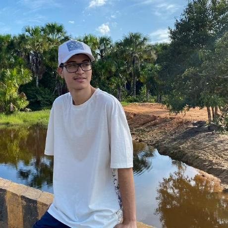
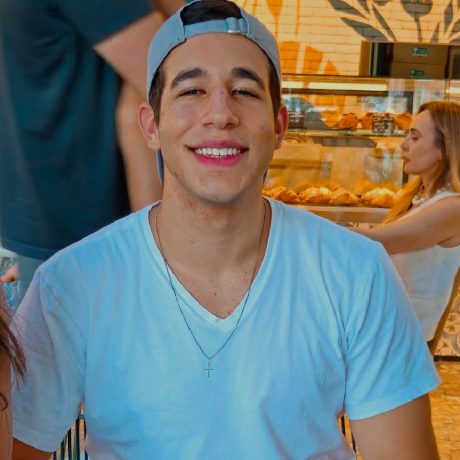
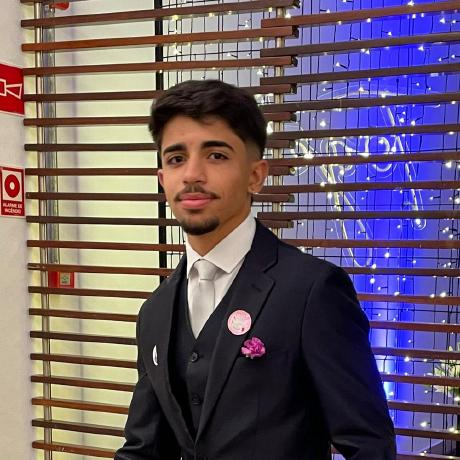
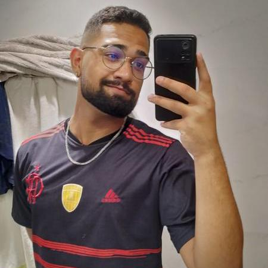

# Concursei BR

<h3> Este projeto envolve a matéria de Métodos de Desenvolvimento de Software e a sua ultilização prática no desenvolvimento de sistemas. A aplicação visa oferecer à população interressada, uma visão mais simplificada dos processos públicos com inscrição em andamentos e também com datas previstas. O Concursei BR oferece os dados de concursos em todo o Brasil para a visualização.</h3>

  

# Nossa Equipe

## Colaboradores

    
     
    <a href="https://github.com/EduardoWaski">EduardoWaski</a>

    
     
    <a href="https://github.com/RR2M4A">RR2M4A</a>

    
     
    <a href="https://github.com/marcomarquesdc">marcomarquesdc</a>

    
     
    <a href="https://github.com/AndreMeyerr">AndreMeyerr</a>

    
     
    <a href="https://github.com/lfelipebessa">lfelipebessa</a>

    
     
    <a href="https://github.com/ArturDCR">ArturDCR</a>

